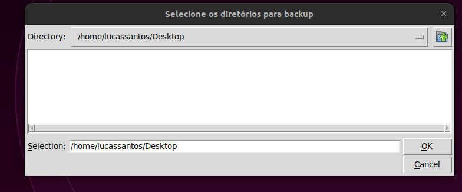
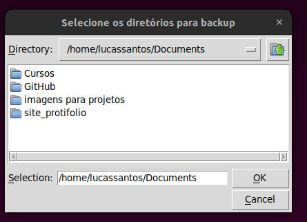
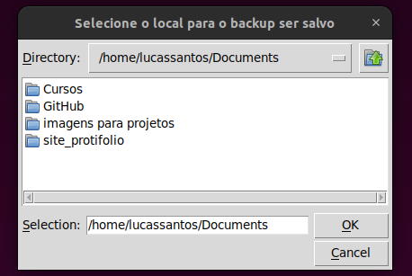
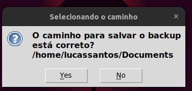
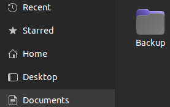
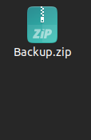
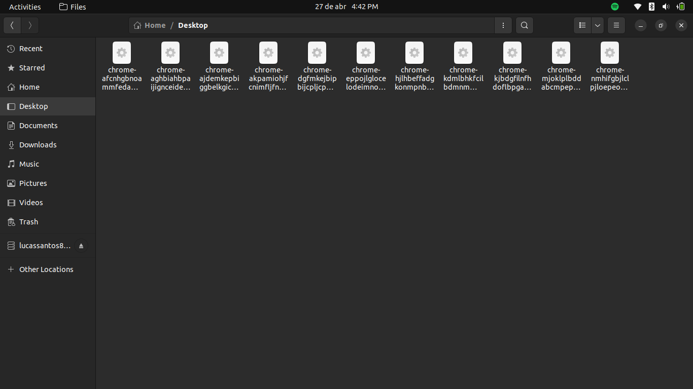
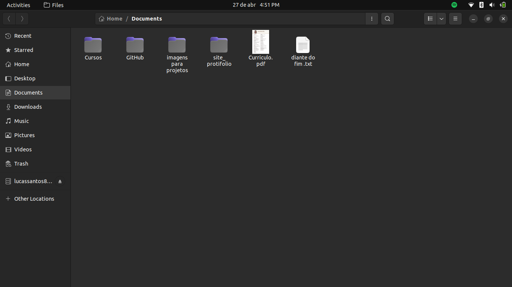
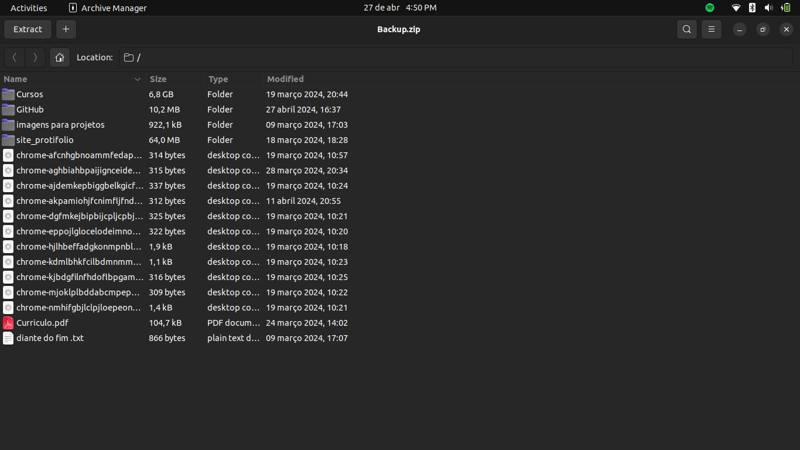

# Backup com Python 🐍

## índice 🏹
- <a href='#introdução'>Introdução</a>
- <a href='#explicação-do-código'>Explicação do Código</a>
- <a href='#olá-eu-sou-o-lucas-👋'>Sobre mim</a>

## Introdução
Olá, criei esse código para treinar a integração do python com as pastas do computador, então pensei em fazer um código que realiza um backup do seu computador, você selecionas as pastas que quer salvar e o código automaticamente salva tudo em um arquivo chamado Backup.zip, esse código pode ser muito útil para quando você esquece de fazer backup dos arquivos do seu PC, basta transformá-lo em um executável e agendar para ele ser executado no período que você desejar. Agora vou explicar o código.

## Explicação do Código

O código está separado em dois arquivos, o main que basicamente apenas chama as funções para o programa ser executado e o arquivo das funções, neste arquivo está toda a lógica do programa, então vou explicar função por função e o que ela faz.

Paro o programa funcionar precisamos importar algumas bibliotecas, todas elas já vem por padrão com o python então é apenas copiar o comando abaixo:


```python 
from tkinter import messagebox, filedialog
from pathlib import Path
import shutil
```
- A biblioteca tkinter foi usada para criar as janelas para a seleção dos diretórios
- A biblioteca pathlib foi usada para fazer a integração com as pastas do computador
- A biblioteca shutil foi utilizada para compactar a pasta no arquivo .zip

Vamos a primeira função: 
```python
def pastas_backup():
    lista_diretorios = []
    while True:
        diretorio = filedialog.askdirectory(title='Selecione os diretórios para backup')
        if diretorio not in lista_diretorios:
            lista_diretorios.append(diretorio)
        parar = messagebox.askyesno('Gerando os caminhos', 'Precisa fazer backup em mais um diretório?')
        if not parar:
            break
    return lista_diretorios
```
Esta função pergunta ao usuário quais pastas ele deseja fazer backup, depois que o usuário selecionar todas as pastas o seu caminho é salvo em uma lista para podermos usar no futuro, pois com os caminhos das pastas pegaremos todo o seu conteúdo para salvar no futuro, é uma função bem simples, pois quis que cada função apenas uma função para o código não ficar muito confuso.

Agora para a segunda função:
```python
def local_backup():
    while True:
        caminho = filedialog.askdirectory(title='Selecione o local para o backup ser salvo')
        parar = messagebox.askyesno('Selecionando o caminho', f'O caminho para salvar o backup está correto?\n'                                                     f'{caminho}')
        if parar:
            break
    return caminho
```
Com essa função eu pergunto ao usuário qual o local que ele deseja salvar o seu backup (o arquivo .zip que vai ser gerado) depois de todo o programa ser realizado.

Agora a terceira função:

```python
def separando_arqdir(diretorios):
    lista_arquivos = []
    lista_diretorios = []
    for diretorio in diretorios:
        diretorio = Path(diretorio)
        arquivos = diretorio.iterdir()
        for arquivo in arquivos:
            if arquivo.is_dir():
                lista_diretorios.append(arquivo)
            else:
                lista_arquivos.append(arquivo)
    return lista_diretorios, lista_arquivos
```

Essa função pega o caminho de todos os diretórios que o usuário passou e faz uma divisão da seguinte forma, tudo o que é arquivo que está solto vai ter ser caminho salvo na lista_arquivos e todas as pastas vão ter seus caminho salvos na lista_diretorios, isso é importante, pois para copiarmos um arquivo de lugar é com um tipo de código e para as pastas usamos outro código, sendo assim vamos ter uma função para copiar arquivos e outra para copiar as pastas.

Agora para a função que copia os arquivos:

```python
def copiando_arquivos(arquivos, caminho_backup):
    if Path(caminho_backup / Path('Backup')).exists():
        for arquivo in arquivos:
            shutil.copy2(arquivo, Path(caminho_backup / Path('Backup')))
    else:
        Path(caminho_backup / Path('Backup')).mkdir()
        for arquivo in arquivos:
            shutil.copy2(arquivo, Path(caminho_backup / Path('Backup')))
```

Esta função faz o seguinte, pega todos os caminhos dos arquivos que a função anterior separou e coloca todos eles numa pasta chamada Backup, essa pasta vai ficar localizada no local que o usuário tinha solicitado no ínicio do código. Esta função apenas copia os arquivos, então eles ainda ficaram nas suas pastas de origem também.

Agora para a função que copia os diretórios:

```python
def copiando_diretorios(diretorios, caminho_backup):
    for diretorio in diretorios:
        nome_diretorio = Path(diretorio).name
        novo_caminho = Path(caminho_backup / Path('Backup') / Path(nome_diretorio))
        shutil.copytree(diretorio, novo_caminho)
```

Essa função faz quase a mesma coisa que a última função citada, com apenas a diferença que ela vai copiar as pastas que o usuário tinha informado. As pastas serão salvas com os nomes que elas possuem. Mais a frente irei mostrar o código funcionando para exemplificar melhor essas duas funções.

Agora para a última função:

```python
def zip_folder(caminho_backup):
    nome_zip = caminho_backup + '/Backup'
    shutil.make_archive(nome_zip, 'zip', nome_zip)
    shutil.rmtree(nome_zip)
```
Essa função pega o caminho fornecido pelo usuário na função local_backup e cria o arquivo .zip, lembrando que a pasta é criada com o nome Backup então por isso temos o '/Backup' sendo concatenado junto com o caminho backup, o shutil.make_archive cria o arquivo Backup.zip no local fornecido pelo usuário e depois que o arquivo é criado a pasta é automaticamente deletada para não termos dois arquivos com os mesmos conteúdos e ocupando assim mais memória desnessessária, após o código finalizar você pode pegar esse arquivo gerado e colocar em qualquer lugar para ter mais de um lugar com o seu backup, como por exemplo colocá-lo na nuvem ou em um pendrive.

## Executando o código

Primeiro temos que decidir quais as pastas vamos querer compctar, nesse caso vou escolher a Desktop e a Documents:



Após selecionar um diretório o programa perguntará se você deseja escolher mais algum para fazer o backup, caso você queira clique em 'Yes', se não precisar clique em 'No':


Como nós vamos fazer o backup de duas pastas, a primeira janela irá aparecer novamente e após selecionarmos a pasta de Documents o programa irá perguntar mais uma vez se queremos mais um diretório, como esse era o último clicarei em 'No', mas caso você queria fazer backup de mais diretórios clique em 'Yes':





Após isso o programa perguntará qual o local eu desejo salvar o arquivos zip, no meu caso selecionarei o diretório Documents:



Após isso ira aparecer uma tela para você confirmar o local, para caso você tenha selecionando errado. Caso você tenha selecionado errado, o programa ira voltar para você selecionar o local correto.



Depois disso o programa irá colocar tudo na pasta Backup, no meu caso ela etá no Documents, o próprio código cria a pasta então ela não precisa existir antes do código ser executado. Esse processo pode demorar um pouco dependendo da quantidade do conteúdo contido nas pastas.



Após isso o arquivo Backup.zip é criado e a pasta é excluída e uma mensagem aparece para informar que o código acabou.




Comparando o conteúdo das pastas que selecionei com o backup:





e esse é o código que chama as funções:

```python
import funcoes
from tkinter import messagebox

diretorios = funcoes.pastas_backup()
caminho_backup = funcoes.local_backup()
dirs, arqs = funcoes.separando_arqdir(diretorios)
funcoes.copiando_diretorios(dirs, caminho_backup)
funcoes.copiando_arquivos(arqs, caminho_backup)
funcoes.zip_folder(caminho_backup)
messagebox.showinfo('Backup Finalizado', 'Backup Realizado com sucesso!!')
```

No inicio importamos os códigos das funções e o tkinter (de toda a biblioteca do tkinter importamos apenas a messagebox)

Quando o código começa os caminhos que o usuário tinha selecionados são salvos na variável diretorios, depois é selecionado o local para o backup e salvo na variável caminho_backup.

Já na função para separar arquivos de pastas fazemos o unpacking, primeiro teremos uma lista com todos os caminhos dos diretórios e depois teremos uma lista com todos os arquivos, nas funções de mover arquivos e pastas passamos o local para o backup e o caminho de seus arquivos/pastas e no final de tudo criamos um arquivo zip e mostramos uma mensagem para avisar o usuário que o programa foi finalizado.


# Olá, eu sou o Lucas! 👋
Aos 19 anos, trilho meu caminho na Ciência de Dados com paixão pela programação. Com habilidades avançadas em Python e conhecimento intermediário em SQL, enfrento desafios com entusiasmo, especialmente na criação de inteligência artificial. Embora meu inglês seja inicial, estou dedicado aos estudos para aprimorá-lo. Estou aqui para aprender, crescer e deixar minha marca na interseção entre dados e inovação.

## Links para me contatar 🔗 
[](https://github.com/LucasSantos875478)
[](https://www.linkedin.com/in/lucas-santos-454584285/)
[](https://www.instagram.com/lucassantos.py/)
